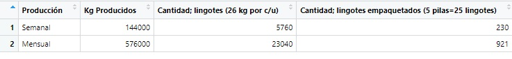

```{r setup, include=FALSE}
knitr::opts_chunk$set(echo = TRUE)
```

## Autores:

* Castillo, César Alejandro ccastillo@fi.unju.edu.ar
* Gallardo, Federico Luis
* Llusco, David

## 1- Introducción

**Empresa; RECIPAL RECICLADOS PALPALÁ S.R.L.:**

1.1. Industria de reciclaje de baterías:  

Las plantas recicladoras de plomo, son empresas de la rama de industrias manufactureras dedicadas a la actividad del reciclaje de plomo, el cual es extraído de las baterías usadas provenientes de diferentes puntos de ventas de baterías como así también de chatarrerías.-  

Cuando las baterías alcanzan el 80 % de su capacidad nominal se considera que han llegado al final de su vida útil y deben ser reemplazadas. Las baterías gastadas, debido a su contenido de plomo y ácido sulfúrico, se han convertido en un residuo peligroso y no pueden descartarse como cualquier residuo domiciliario, cuyo destino final es un relleno sanitario. Por otra parte, una batería de plomo-ácido es un producto cuyos materiales pueden ser reciclados en su totalidad.

1.2. Descripción de la empresa - Breve reseña histórica:  

Reciclados pálpala es una empresa con más de dieciocho (18) años en el rubro, su nacimiento fue origen de la concientización y la preservación de nuestros recursos naturales para las futuras generaciones. Originalmente llamada LOS FLAMENCOS, hasta que en el 2011 la empresa se divide en dos (2). LOS FLAMENCOS S.A.: encargada de la recuperación del plástico de las baterías transformándolas en pellets de plástico y RECICLADOS PALPALÁ S.R.L.: encargada de la recuperación del plomo y transformarlas en lingotes.-  

Ambas empresas pertenecen al “GRUPO EDNA”. Cabe destacar que dicha empresa (“RECICLADOS PALPALÁ”) trabaja bajo sistema de gestión de calidad ISO 9001. Está compuesto de personal altamente calificado en la materia, trabajando en los distintos niveles desde; operarios, supervisores, coordinadores y gerente entre otros, llegando a un total de 50 personas aproximadamente.-  

Sus principales clientes son de nivel nacional como internacional, cuyo porcentaje de producción mensual destinado a cada uno de ellos son:

- Grupo Edna 50%.-  
- Córdoba 35%.-  
- Región; cuyo: 15%.-  
- Brasil 5%.-  

La empresa industrializa cuatro clases distintivas de plomos y aleaciones:  

· Plomo refinado 99.98%.-  
· Plomo aleado con antimonio.-  
· Plomo aleado con calcio, estaño y plata.- 
· Plomo aleado con selenio.-  

1.3. Ubicación de la planta:  

La planta se encuentra localizada sobre la Ruta N° 49 Km 3 en el Parque Industrial Alto La Torre, ciudad de Palpalá, provincia de Jujuy.-  

## 2- Situación del problema

Existe un procedimiento precario en la recolección de datos del proceso productivo, se realizan sin ninguna programación, impidiendo gestionar la información de manera efectiva, para la toma de decisiones. 

## 3- Estado del arte

Mentzer et al [@mentzermin] proporciona una revisión de la literatura existente en cuanto a las definiciones de cadena de abastecimiento y la Gerencia de la Cadena de Abastecimiento, generando la siguiente definición: “Cadena de Abastecimiento es un conjunto de tres o más entidades (organizaciones o individuos) directamente relacionados hacia adelante y hacia atrás a través de flujos de producto, servicios, finanzas y/o información desde una fuente hasta un cliente”. 

@lummus1997supply afirman que una cadena de suministro es una red de entidades en la cual el material fluye. Estas entidades pueden incluir proveedores, transportistas, fabricas, centros de distribución, comerciantes y clientes finales. 

La gestión de la cadena de suministros consiste en la integración de los procesos de negocio desde el usuario final hasta los proveedores originales que abastecen de los productos, servicios e informaciones que añaden valor para los clientes o usuarios finales y los propietarios de recursos (según Global Supply Chain Forum). 

## 4- Objetivos 

4.1. Objetivo general. 

Optimizar el procedimiento de recolección y sistematización de datos, del proceso productivo de la empresa, para gestionar de manera efectiva la información y la toma de decisiones estratégicas. 

4.2. Objetivos específicos. 

Para la resolución del proyecto, se solicita el análisis de los siguientes puntos: 

- Procedimiento actual de registro de datos. 
- Descripción de proceso productivo. 
- Mejorar en la recolección y gestión de datos. 
- Graficas estadísticas, con el software “RStudio”. 

## 5- Materiales y métodos o marco teórico

Estrategias fundacionales que se establecen para poder captar y gestionar los datos del proceso productivo: 

5.1. Planificación estratégica. 

Misión:   

Reciclar baterías para cuidar el medio ambiente. A través de la incorporación de tecnología y un fuerte desarrollo de mano de obra, convirtiendo estos productos desechados en materia prima, para producir plomo de máxima calidad. 

Visión:  

Ser la empresa recicladora líder del país en cuanto a cantidad y calidad de producción, logrando ser distinguido tanto en el ámbito nacional e internacional. 

Valores:  

- Calidad: no solo en el orden de los productos y servicios que se ofrece, sino también en el orden, limpieza, autoestima y disciplina. 
- Seguridad: es una de las principales prioridades. La seguridad del personal de trabajo. 
- Responsabilidad: fuerte compromiso con la comunidad y el medio ambiente.
- Satisfacción del Cliente: superando las expectativas y necesidades. 

Objetivos Generales de la organización:  

- Cumplir con el plan de producción mensual. 
- Recolectar la mayor cantidad de materia prima, para el proceso de reciclado. 
- Cumplimiento del plan de capacitación. 

Ventaja competitiva: 

Reciclados pálpala es una empresa que se encuentra en el negocio de la fundición de metales no ferrosos, cuya estrategia de diferenciación se basa en la calidad, “regida bajo normas ISO 9001” (no solo en el producto terminado, sino también en la materia prima utilizada), buscando la satisfacción y seguridad de los clientes internos como externos, generando alianzas con los proveedores para cumplir con la demanda del mercado objetivo y expandir los productos a otras regiones.

5.2. Descripción del proceso productivo. 

El proceso productivo cuenta con cinco (5) etapas para cumplir con el plan de producción. A continuación se describe cada uno de ellos.

Etapa 1: Trituración: 

Las baterías de plomo-acido usadas (materia prima) son desarmadas mecánicamente por una trituradora, estas ingresan por la tolva y son desintegradas mediante un tornillo con pastillas cortantes.

La máquina posee un sistema mecánico- hidráulico (tacho decantador), el cual separa por gravedad los diferentes componentes de la chatarra de baterías. Entre los componentes que son separados se pueden mencionar: plomo, lodos de óxidos, plástico polipropileno, papel de polietileno y acido. La separación por precipitación divide por un lado el plástico y demás materiales con menor peso específico, flotan en la superficie y son transportados mediante paletas, primeramente y luego mediante un tornillo sin fin a bolsas que se almacenan para venderlas a la empresa los Flamencos S.A. Por otro lado el los barros de plomo (plomo y óxidos de plomo), con mayor peso específico decantan y son retirados de la base del tacho mediante otro tornillo sin fin sumergido hacia la siguiente etapa del proceso. Por último el ácido queda contenido en el tacho decantador, es bombeado a una planta de tratamiento para recibir la neutralización correspondiente. La fábrica cuenta con dos máquinas trituradoras.

Etapa 2: Preparación de insumos y proceso de mezcla: 

En este proceso se procede a dosificar - mezclar los distintos reactivos y preparar todo el material para que sea llevado a los Hornos. Se combina el plomo (Plomo metálico, óxido de plomo, sulfato de plomo y otros metales como calcio, cobre, antimonio, arsénico, estaño y a veces, también plata), proveniente de las trituradoras con la escoria del horno BBU, borato, viruta y drosser fino para el horno Rotativo, y para el Horno BBU; plomo, borato y viruta.

Para llevar a cabo la mezcla de insumos se hace uso de un brazo mecánico que en su extremo posee un recipiente para mezclar (mini -cargador frontal de cucharón).

Etapa 3: Proceso de fundición: 

En este proceso básicamente se funden el barro de plomo-deshidratado, cenizas de plomo recuperado, reactivos y fundentes tales como: carbonilla, borato, coipa, hierro y demás insumos los cuales actúan cómo agentes oxi-reductores.- 

De este proceso resultan dos capas fundidas. La capa superior contiene las escorias y la capa inferior es la que contiene el plomo obra. Esta última es la que se destina al siguiente proceso.- 

En los hornos de fundición se producen reacciones metalúrgicas físico-químicas de fusión, reducción y oxidación del material. Específicamente un 65% son reducidas a plomos metálicos (plomo obra), los cuales son extraídos a moldes para su manejo posterior. También en un 30% son extraídas las escorias sobrantes, las cuales son depositadas en moldes para luego ser transportadas a su lugar de confinamiento.- 

Para este proceso se cuenta con dos (2) hornos, a continuación su descripción:  

- Horno BBU (2) con una capacidad de 24tn/día – temperatura de fusión; 600°C.- 

- Horno Rotativo (3) con capacidad de 15 tn/día – temperatura de fusión; 950°C.-  

Etapa 4: Proceso de refinación: 

El plomo de obra obtenido como producto de la fusión, se almacena, para poder pasar a un proceso de refinación el cual consta de cuatro etapas (Desferrado, Decuperizado, Ablandado y Lavado Final):  

DESFERRADO: 

El plomo de obra con 98% de pureza es colocado en una olla y fundido aproximadamente por 1 hora, a una temperatura de 500 ºC; con la finalidad de separar el hierro.- 

DECUPERIZADO: 

Proceso seguido al proceso de desferrado, que consiste en sacar el cobre (Cu) presente en el metal, para lo cual se adiciona azufre industrial.  

El decuperizado se realiza a una temperatura que varía entre 330 – 340 °C, por un espacio de 3 horas. El cobre que se elimina es retirado en forma de polvo negro, mediante unos cucharones diseñados especialmente para esta función, al igual que el hierro.- 

ABLANDADO:  

Este proceso se realiza con la finalidad de eliminar el antimonio del metal (plomo), para ello se inyecta Oxígeno, con agitación continua por 5 horas a una temperatura de 650 °C.

En esta parte de proceso se logra obtener plomo con un 99,98% de pureza.

LAVADO FINAL: 

En esta etapa se realiza un lavado final con adición de soda cáustica, por el periodo de 2 horas.

Etapa 5: Proceso de elaboración lingotes: 

En la etapa de elaboración de lingotes se vierte plomo fundido de las ollas de refinación en moldes, inmediatamente comienza a solidificar, empezando desde la superficie del molde y progresando hacia el centro.

Posteriormente se realiza el control de calidad de los productos obtenidos, generando en ellos códigos de identificación. Por último se gestiona su agrupación y depósito.

5.3. Diagrama de flujo operativo

#{width=80%}

## Caso de estudio 

En este apartado se pretende resumir, el análisis estadístico del proceso productivo

Etapa Trituración: 

**- Proceso – balance de masa: **

A la etapa, llega la materia prima (baterías en desuso) en tarimas de 1600 kg aproximadamente. Se las clasifica en tres (3) tipos: 

- Tipo 1: baterías autos-camiones.- 
- Tipo 2: baterías de moto.- 
- Tipo 3: cajas plásticas.- 

El proceso cuenta con dos trituradoras y aproximadamente trituran tres (3) tarimas por turno cada una.-  

En síntesis por día cada trituradora procesaría 9 tarimas.- 

Parámetro de balance de masa: producción diaria: 

#{width=80%}

**Descripción dimensional de la etapa productiva: (ver plano de distribución física).**

Como se describe anteriormente las etapas; de materias primas y trituradoras, confluyen en la primera nave industrial.-

Las medidas de la nave son; 19,00 m x 44,00 m, abarcando un área total de 836,00 m2.-

#{width=80%}

Etapa: ZONA DE MEZCLAS – FUNDICIÓN.

**Proceso – balance de masa - descripción dimensional de la etapa productiva:**

#{width=80%}

En zona de mezclas, se deposita el barro plomo que llega del proceso de trituradoras y los insumos para las dosificaciones que se necesitan para fundir en los hornos.

Cuenta con una superficie de 800,00 m2 aproximadamente (44,50 m x 18,35 m).

#{width=80%}

La zona de Fundición abarca una superficie de 432,00m2 aproximadamente (16,00 m x 27,00 m) y se disponen en el tres (3) hornos;

#{width=80%}

Las superficies que se especifican en el cuadro, particularmente los hornos rotativos, contemplan las campanas extractoras de humos.-

El horno Rotativo 2 en el transcurso de la práctica en fábrica, no estuvo en funcionamiento.-

Según la información del balance de masa, la producción de plomo obra es:

#{width=80%}

Medición del proceso de fundición:

#{width=80%}

Aproximadamente tarda 10hs en completar el proceso de fundición de cada Horno.-

En un día de tres turnos, generalmente se realiza una fundición por cada horno ya que el tiempo restante se utiliza para calentar los hornos y preparar las dosificaciones (mezcla m.p.) para las fundiciones correspondientes.-

Etapa: REFINACIÓN.

**Proceso – balance de masa - descripción dimensional de la etapa productiva:**

Parámetro de balance de masa: producción para una olla de refinación:

La etapa productiva cuenta con cuatro ollas de refinación, con capacidad cada una de 43000 kg.-

#{width=80%}

El proceso de cada olla consta de cuatro (4) etapas:

#{width=80%}

Según el cuadro el tiempo promedio en que se incurre para refinar cada olla, es de 15 hs.-

Los operarios encargados de refinar las ollas, no toman el tiempo descripto anteriormente, como indicador, esto se debe a que los 43000 kg de plomo obra, a refinar, llegan de diferentes procesos de fundición e insumos.-

Existen varias razones que causan esta inestabilidad en el proceso:

- Grandes porcentajes de elementos tales como el Antimonio y el Estaño en Pb nos retarda la limpieza de la olla. El Estaño es uno de los elementos que alargan el tiempo de limpieza. En porcentaje por debajo del 0,12 el Sn se volatiliza, pero cuando presenta porcentajes entre 0,15-0,30 se recupera en forma ceniza de Sn.- 

- El otro elemento es el Antimonio que se encuentra en el Plomo obra en porcentajes de 0,7-0,9. A mayores valores (1,25) se deberá incurrir mayor tiempo el extraerlo en forma de Ceniza de Antimonio.-

Es por todo ello que el verdadero tiempo de refinación por cada olla es de aproximadamente 48hs a 72hs.-

La producción objetivo por mes de plomo refinado es de 500 tn aproximadamente, si cada olla tiene capacidad de refinar 35690 kg, para llegar a lo propuesto en producción, se tienen que refinar 14 ollas por mes. A continuación se describe el número de ollas refinadas al mes;

#{width=50%}

El siguiente cuadro describe los insumos que se utilizan por cada olla de refinación;

#{width=80%}

La zona de Refinación abarca una superficie de 176,00m2 aproximadamente (11,00 m x 16,00 m) y se disponen en el cuatro (4) ollas de refinacion;

#{width=80%}

Nota; el proceso de elaboración de lingotes se encuentra en la misma zona de refinación (ver plano).- 
Etapa: LINGOTEO.-

**Proceso – balance de masa - descripción dimensional de la etapa productiva:**

En la etapa de lingoteo se vierte Plomo fundido en moldes de lingotes, inmediatamente comienza a solidificar, empezando desde la superficie del molde y progresando hacia el centro.- 

Medición del proceso de lingoteo:

Durante la semana se realiza 4 lingoteos de Plomo, que son extraídos de las hoyas de refinamiento cuya capacidad de cada una es de 43 Tn. En realidad en el proceso se extraen 83% de plomo refinado es decir aproximadamente 36 tn. Lo que nos lleva a estimar:

#{width=80%}

El proceso de cada lingoteo dura aproximadamente cuatro (4) horas.

#{width=80%}

#{width=70%}

Consta de tres (3) etapas: 

Para la descripción y medición de tiempo de producción de lingotes de plomo del cuadro, se toma como parámetro 1 pila de lingotes; la misma cuenta con cinco (5) lingotes de 25 kg de peso cada uno.

#{width=80%}

Con los datos de lingoteo que se realizan por semana y la descripción en peso de lingotes producidos, se tiene el siguiente cuadro;

#{width=100%}

**Gráficos utilizando DATASET**

```{r}
barplot(c(529040,27840,25000),
        names.arg = c("Escoria Pb","Plastico","Planta Tratamiento"),
        main = "Producción Proceso de Trituración",
        ylab = "Producción",
        xlab = "Sectores",
        col = c("coral","azure3","green")
)
```

```{r}
barplot(c(194892,131144,73476,0),
        names.arg = c("Pb Puro","Pb Ca","Pb Sb", "Pb Se"),
        main = "Producción Proceso de Refinacion",
        ylab = "Producción",
        xlab = "Sectores",
        col = c("coral","azure3","green")
)
```
```{r}
barplot(c(384448,75591,62970),
        names.arg = c("PLOMO DE OBRA","ESCORIA NEGRA","HUMOS"),
        main = "Producción Proceso de Trituración",
        ylab = "Producción",
        xlab = "Sectores",
        col = c("coral","azure3","green")
)
```


## 6. Interpretación de los resultados

Tras la optimización del procedimiento de recolección y sistematización de datos en el proceso productivo de la empresa, se han logrado avances significativos que permiten gestionar la información de manera efectiva y respaldar la toma de decisiones estratégicas. A continuación, se describen algunos resultados positivos:
Mejora en la calidad y precisión de los datos: El nuevo procedimiento implementado ha permitido recopilar datos de manera más precisa y confiable. La programación establecida ha asegurado que la recolección de datos se realice de manera sistemática y oportuna, evitando errores y omisiones. Esto ha llevado a una mayor confianza en los datos recopilados y ha mejorado la calidad de la información disponible para la toma de decisiones.
Mayor eficiencia en la recolección de datos: La implementación de formularios digitales, aplicaciones móviles u otros medios electrónicos ha agilizado el proceso de recolección de datos. Esto ha permitido a los empleados recopilar información de manera más eficiente, reduciendo el tiempo y los recursos dedicados a esta tarea. Como resultado, se ha liberado tiempo adicional para otras actividades importantes dentro del proceso productivo.
Mayor comprensión del proceso productivo: La descripción detallada del proceso productivo ha permitido una mejor comprensión de cada etapa y de las interacciones entre ellas. Esto ha facilitado la identificación de áreas de mejora y la implementación de soluciones más efectivas. Al comprender mejor el proceso, la empresa está en una posición más sólida para optimizar la productividad, reducir los tiempos de producción y mejorar la calidad del producto.

## 7. Aportes y contribuciones

Los siguientes aportes y contribuciones tuvieron como objetivo optimizar la recolección y sistematización de datos en el proceso productivo de la empresa, lo que a su vez facilitará una gestión efectiva de la información y una toma de decisiones estratégicas más informada.
Implementación de un sistema de programación y planificación: Establecer un cronograma y un plan para la recolección de datos, definiendo claramente los momentos y las responsabilidades de cada etapa del proceso. Esto asegurará que la recolección de datos se realice de manera sistemática y oportuna.
Digitalización de los registros: Introducir formularios digitales, aplicaciones móviles u otros medios electrónicos para capturar datos en lugar de métodos manuales. Esto reducirá los errores de entrada de datos y agilizará el proceso de recopilación.
Establecimiento de estándares y protocolos: Definir estándares y protocolos claros para la recolección de datos, incluyendo formatos, unidades de medida y etiquetas. Esto asegurará la uniformidad y coherencia de los datos recopilados, facilitando su posterior análisis y comparación.
Capacitación y concientización del personal: Proporcionar capacitación adecuada a los empleados responsables de la recolección de datos, para garantizar que comprendan la importancia de su rol y estén familiarizados con los procedimientos y estándares establecidos. Además, promover la conciencia sobre la calidad y precisión de los datos entre todo el personal.
Uso de tecnología avanzada: Explorar tecnologías como sensores de monitoreo, Internet de las cosas (IoT) o sistemas de captura automática de datos para recopilar información en tiempo real. Esto permitirá una recopilación más precisa y eficiente de los datos del proceso productivo.
Implementación de un sistema de gestión de datos: Utilizar una base de datos centralizada o un sistema de gestión de datos empresariales para almacenar, organizar y gestionar los datos recopilados. Esto facilitará el acceso a la información, su análisis y la toma de decisiones basadas en los datos.
Análisis estadístico y visualización de datos: Utilizar herramientas como RStudio para realizar análisis estadísticos y generar gráficos que ayuden a visualizar y comprender los datos recopilados. Esto permitirá identificar patrones, tendencias y oportunidades de mejora en el proceso productivo.

## 8. Referencias bibliográficas


